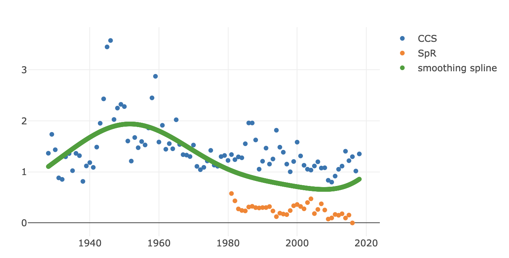

# Simple Smoothing Spline

> Fit a smoothing spline to collection of data points

[](https://umn-latis.github.io/simple-smoothing-spline)
## Usage

```js
const data = [
  { x: 1, y: 0.5 },
  { x: 2, y: 3 },
  { x: 3, y: 8.5 },
  { x: 4, y: 20 },
  { x: 1, y: 1 },
  { x: 2, y: 5 },
  { x: 3, y: 11 },
  { x: 4, y: 15 },
];

const spline = simpleSmoothingSpline(data, { lambda: 1000 });

// spline.points is a collection of {x, y} values
// between the min and max the x values in the data set
graphItWithYourOwnFunction(spline.points);

// spline.fn is a function that can return a y for a given x
const myY = spline.fn(2.5);
// 6.25
```

## Installation

### Using NPM or Yarn

```console
npm install simple-smoothing-spline
```

```console
yarn add simple-smoothing-spline
```

### With a `<script>` tag

Added this **before** your main script:

```html
<!-- index.html -->
<script
  src="https://unpkg.com/simple-smoothing-spline/dist/index.umd.min.js"
  async
></script>
```

Then, in your scripts, you can call a global `simpleSmoothingSpline()` function.

## API

### `simpleSmoothingSpline(data, opts)`

Parameters:

- `data` - an array of data points in the form of `{x: 1, y: 2}`.
- `opts.lambda = 1000` - lambda parameter for Ridge regression. This is the tuning parameter for the regression function. The higher the lambda, the smoother the spline will be. By default, this is 1000.

Returns:

- `spline.points` - An array of `{x, y}` points on the smoothing spline in the range of the data (between min(x) and max(x)).
- `spline.fn` - A function to get an arbitrary f(x) for a given x.

  Example:

  ```js
  const spline = simpleSmoothingSpline(data, { lambda: 2 ** 8 });
  const y = spline.fn(3);
  // y is value on the spline when x = 3
  ```

## Example

An example using Plotly JS can be found at <https://umn-latis.github.io/simple-smoothing-spline>

## About

- [Background notes and references](./NOTES.md)
- [Maintainers](.github/CODEOWNERS)
- [Contributors](https://github.com/UMN-LATIS/simple-smoothing-spline/graphs/contributors)

## License

MIT
